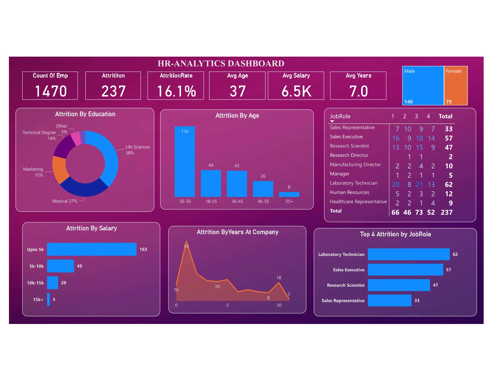

# Attrition Insights: Unveiling Patterns through HR Data Analysis

## December, 2023

**Project Overview:**

In December 2023, I led a comprehensive HR data analysis project aimed at understanding and mitigating attrition trends within the organization. Attrition, or employee turnover, can have significant implications for businesses, including increased recruitment costs, loss of institutional knowledge, and decreased employee morale. By leveraging advanced analytics techniques and data visualization tools, the project aimed to identify key factors contributing to attrition and develop actionable insights to address the issue.

**Project Objectives:**

1. **Identify Attrition Patterns:** The primary objective was to analyze historical HR data to identify patterns and trends related to employee attrition. This involved examining various factors such as demographics, job roles, tenure, performance ratings, and compensation to uncover potential correlations and predictors of attrition.

2. **Understand Contributing Factors:** Another key focus area was to understand the underlying factors contributing to attrition increase within the organization. By conducting in-depth statistical analysis and hypothesis testing, the project aimed to identify root causes such as job dissatisfaction, lack of career development opportunities, or organizational culture issues.

3. **Develop Mitigation Strategies:** Based on the insights gained from the data analysis, the project aimed to develop targeted mitigation strategies to reduce attrition rates and improve employee retention. This involved designing interventions such as improved employee engagement initiatives, career development programs, and performance management enhancements tailored to address specific attrition drivers.

**Development Process:**

### Data Collection and Preparation:

The first step in the project involved gathering and preparing the necessary HR data for analysis. This included data on employee demographics, employment history, performance evaluations, compensation, and exit interviews. Special attention was given to data quality and integrity, with rigorous cleaning and validation processes to ensure accuracy and consistency.

### Statistical Analysis and Modeling:

With the clean dataset in hand, the project proceeded to conduct a series of statistical analyses to uncover insights into attrition patterns and drivers. Techniques such as regression analysis, survival analysis, and correlation analysis were employed to identify significant predictors of attrition and assess their impact on employee turnover.

Advanced modeling techniques, including machine learning algorithms such as decision trees and random forests, were also utilized to develop predictive models for forecasting future attrition trends. These models provided valuable insights into the likelihood of attrition for individual employees and enabled proactive intervention strategies.

### Data Visualization with Power BI:

To facilitate data exploration and communication of findings, an interactive Power BI dashboard was designed and created. The dashboard featured dynamic visualizations such as bar charts, scatter plots, and heatmaps, allowing users to interactively explore HR data and identify trends and patterns related to attrition.

Key metrics such as attrition rates, turnover costs, and employee satisfaction scores were prominently displayed, providing stakeholders with a comprehensive overview of the organization's attrition landscape. Interactive filters and slicers allowed users to drill down into specific segments of the workforce and compare attrition trends across different demographic groups or job roles.

### Dashboard:

.
**Key Features:**

1. **Interactive Dashboard:** The Power BI dashboard offered an intuitive and user-friendly interface for exploring HR data and uncovering insights into attrition trends. Users could interactively filter and slice the data to focus on specific dimensions of interest and dynamically visualize the results.

2. **Predictive Analytics:** Leveraging advanced modeling techniques, the project developed predictive models to forecast future attrition trends and identify employees at high risk of turnover. These predictive insights enabled proactive intervention strategies to be implemented to retain valuable talent.

3. **Actionable Insights:** The project delivered actionable insights into the underlying factors driving attrition within the organization, empowering stakeholders to implement targeted interventions to improve employee retention and reduce turnover costs.

**Conclusion:**

The "Attrition Insights" project represented a significant milestone in leveraging data analytics to address a critical business challenge. By combining advanced analytics techniques with data visualization tools such as Power BI, the project provided valuable insights into attrition patterns and drivers, enabling proactive intervention strategies to be implemented to improve employee retention and organizational performance.

Moving forward, continued investment in data analytics capabilities and a data-driven approach to HR management will be essential for organizations to stay competitive in attracting, retaining, and developing top talent.
